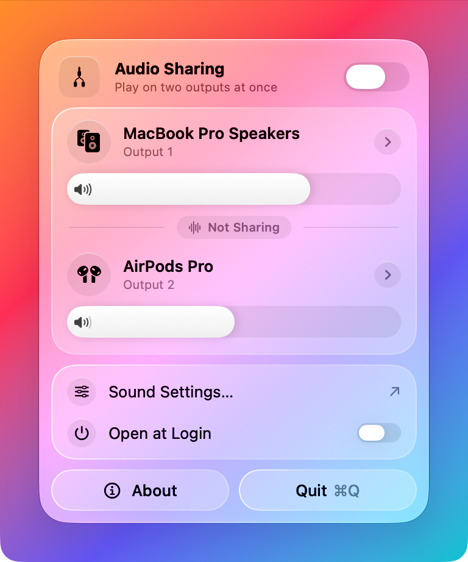
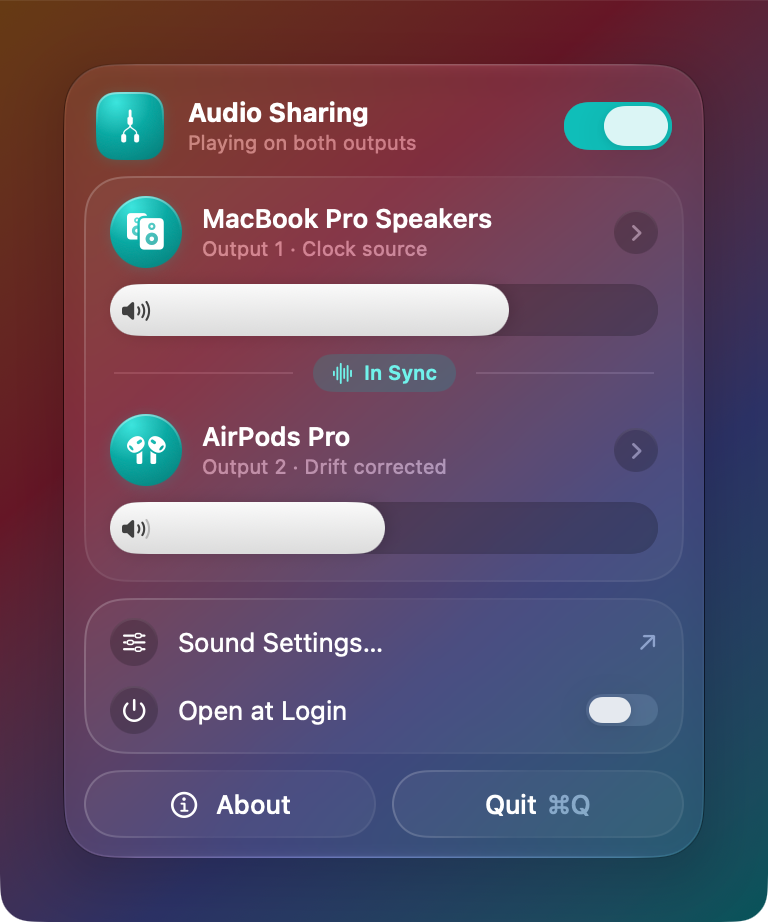

# &nbsp;&nbsp;Duophonic

Listening together matters, because sharing is caring.

> In synthesizers, Duophonic means the ability to play two notes at once.
Duophonic for Mac lets you do the same with sound — listening together.

Easily send macOS audio to two outputs at once — perfect for parties, demos, or running headphones and speakers together. Lightweight, system-aware, and built with Core Audio so everything stays in sync.

|  |  |
|---:|:---|
|  |  |

**Website:** [juri1212.github.io/Duophonic](https://juri1212.github.io/Duophonic/) · **Guide:** [How to play audio on two AirPods (or any two outputs) on a Mac](https://juri1212.github.io/Duophonic/blog/play-mac-audio-on-two-outputs/)

## Quick Download & Install

One-liner for lazy folks:

```bash
curl -sSLO https://github.com/juri1212/Duophonic/releases/latest/download/Duophonic.zip && \
unzip -q Duophonic.zip && \
rm -f Duophonic.zip && \
mv "Duophonic.app" /Applications/ && \
open /Applications/Duophonic.app
```
> Note: Unless the release is notarized, macOS blocks the first launch. See [Troubleshooting](#troubleshooting).

Requires macOS 26.1 or later.

## Features

- Simple UI to create a system-wide aggregate output that plays to two devices at once.
- Choose a primary and secondary output device from the detected hardware list.
- Per-device volume sliders (for devices that support software volume control).
- Drift compensation on the secondary device keeps both outputs in sync during long sessions.
- Switch either output while playing — the multi-output device is updated in place, so playback keeps running. Picking the other slot's device swaps them.
- Follows your hardware: devices that connect or disconnect show up immediately, and a reconnected device rejoins playback automatically.
- Remembers your two outputs between launches and preselects the current output plus a pair of headphones the first time.
- Safe lifecycle handling: the app restores the previous outputs (for audio and for alerts) and removes the multi-output device when disabled, on quit, or when you pick another output in Control Center. If the app was killed, it cleans up on the next launch.
- Ideal for **listening with two pairs of AirPods** (or any two Bluetooth headsets). Create an aggregate output, set each AirPod pair as one of the outputs, and enjoy synced playback between both sets.


## Usage

- Open the app. It lists all detected output-capable audio devices (internal speakers, headphones, external DACs, Bluetooth devices, etc.).
- Click either output to choose its device from the list (the first output is the clock source).
- Use the sliders to set per-device volumes (sliders are disabled if the device does not expose a software volume control).
- Turn on the `Audio Sharing` switch at the top to play on both outputs.
- To stop sharing, turn the switch off, quit the app, or select another output in Control Center — the previous output will be restored.

## Notes & Limitations

- The aggregate device is created as a temporary, app-managed device and is removed when disabled. If the app is terminated unexpectedly the aggregate remains until Duophonic is opened again, which either resumes or removes it. You can also remove it in the Audio MIDI Setup app.
- macOS can't change the volume of a multi-output device, so the volume keys and the Control Center slider don't work while it's enabled. Use the per-device sliders in Duophonic instead.
- Some devices (notably certain Bluetooth or USB audio interfaces) may not expose software volume controls; in that case the slider will be disabled and you'll need to adjust hardware volume on the device itself.
- When a Bluetooth headset's microphone is in use (e.g. during a call), macOS switches it to a lower-quality mode for both playback and recording.

## How It Works

The app uses Core Audio APIs to create a stacked aggregate device that contains the two selected output devices, so both play the same channels. The primary device is the clock source (no drift compensation) while the secondary device is resampled with drift compensation so both outputs stay in sync.

When enabled the app sets the new aggregate as both the default output and the default system output (alerts), after remembering the previous ones. Changing an output while enabled replaces the aggregate's sub-devices in place. When you disable the feature (or quit the app) it restores the previous outputs and removes the aggregate device it created.

## Step by step Installation

- Download the latest release and unzip it with a single command:

```bash
curl -sSLO https://github.com/juri1212/Duophonic/releases/latest/download/Duophonic.zip
unzip Duophonic.zip
rm -f Duophonic.zip
```

- Move the app to `/Applications` and open it:

```bash
mv "Duophonic.app" /Applications/
open /Applications/Duophonic.app
```

## Troubleshooting

- If macOS says the app can't be opened or verified, open `System Settings` → `Privacy & Security`, scroll to the message about Duophonic and click `Open Anyway`. Alternatively, remove the quarantine flag once: `xattr -dr com.apple.quarantine /Applications/Duophonic.app`.
- If "Open at Login" stays pending, allow Duophonic in `System Settings` → `General` → `Login Items`.
- If the downloaded file is different than the example above, replace the file name in the `curl` command with the correct file name shown on the release page.
- Each release ships a `Duophonic.zip.sha256` file to check the download isn't corrupted with `shasum -a 256 -c Duophonic.zip.sha256`.
- To check the download was built from this repository by its release workflow, verify its build provenance with the [GitHub CLI](https://cli.github.com) before unzipping: `gh attestation verify Duophonic.zip -R juri1212/Duophonic`. Do this especially before removing the quarantine flag, as that skips the macOS malware check for unnotarized apps.

## Uninstall

To remove the app and its preferences:

```bash
rm -rf /Applications/Duophonic.app
rm -rf ~/Library/Containers/com.juri1212.Duophonic
```

## Development

Run these after cloning to enable repository hooks and install the formatter:

```bash
git config core.hooksPath .githooks
brew install swift-format
```

Run the unit tests with `⌘U` in Xcode or:

```bash
xcodebuild test -scheme Duophonic -destination 'platform=macOS'
```

### Running from the command line

Build and launch the app without opening Xcode. This works from any checkout, including a git worktree, because the build output goes into the checkout's own (git-ignored) `build/` folder:

```bash
xcodebuild -project Duophonic.xcodeproj -scheme Duophonic -configuration Debug \
  -destination 'platform=macOS' -derivedDataPath build build
open build/Build/Products/Debug/Duophonic.app
```

Quit any other running copy of Duophonic first (e.g. the one in `/Applications`), otherwise macOS may just bring that one to the front. To see the app's console output, run the binary directly instead of using `open`:

```bash
build/Build/Products/Debug/Duophonic.app/Contents/MacOS/Duophonic
```

Core Audio access is behind the `AudioHardware` protocol. `CoreAudioHardware` talks to the system, while the tests and SwiftUI previews use `InMemoryAudioHardware`.

### Testing routing without a second device

[BlackHole](https://github.com/ExistentialAudio/BlackHole) provides virtual outputs that loop their audio back to an input, so you can stand in for real speakers and check what reaches them:

```bash
brew install sox blackhole-2ch blackhole-16ch
```

- `AudioRoutingTests` plays a test tone into a private aggregate of both BlackHole devices and asserts it arrives at each. It also checks that the tone keeps playing while the aggregate is changed in place. The suite is skipped when BlackHole isn't installed. The first run asks for microphone access (Debug builds only), which macOS requires before it records anything other than silence. The tests turn both BlackHole devices up to full volume while they measure and restore your volumes afterwards. CI runs the suite in its own job, which installs BlackHole on the runner.
- `scripts/verify-routing.sh` checks the running app: pick both BlackHole devices in Duophonic, enable it, then run the script. Your terminal needs microphone access.

### Releasing

Push a tag like `v1.2.0` to build the app and publish a GitHub release; the tag sets the version. To ship a signed and notarized app that opens without Gatekeeper warnings, add these repository secrets:

| Secret | Value |
|---|---|
| `MACOS_CERTIFICATE_P12` | Base64 of the exported *Developer ID Application* certificate (`base64 -i cert.p12`) |
| `MACOS_CERTIFICATE_PASSWORD` | Password of that `.p12` |
| `APPLE_TEAM_ID` | Your Apple Developer team ID |
| `NOTARY_APPLE_ID` | Apple ID used for notarization |
| `NOTARY_PASSWORD` | An app-specific password for that Apple ID |

Without them, releases are signed ad hoc.

### Website

The website and blog are static pages in `docs/`, served by GitHub Pages from the `main` branch's `/docs` folder. Preview them with `python3 -m http.server -d docs` and open http://localhost:8000. When adding a post, put it in `docs/blog/<slug>/index.html`, link it from `docs/blog/index.html` and add it to `docs/sitemap.xml`.
